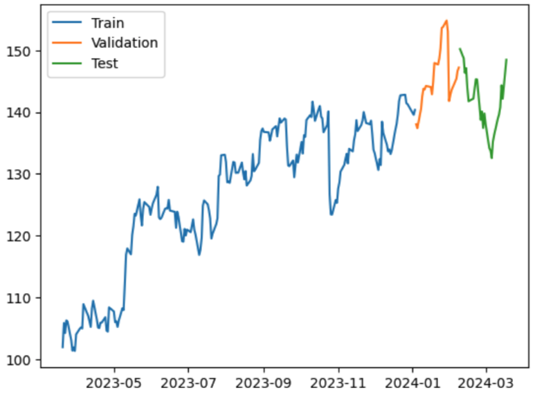
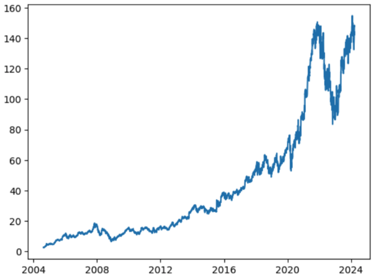
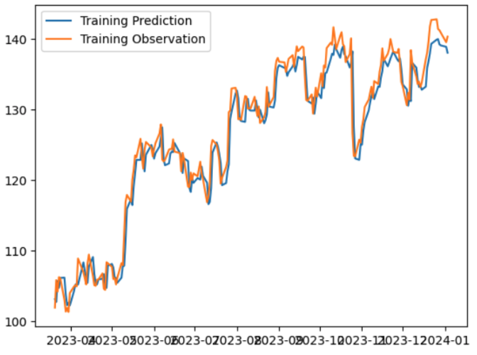
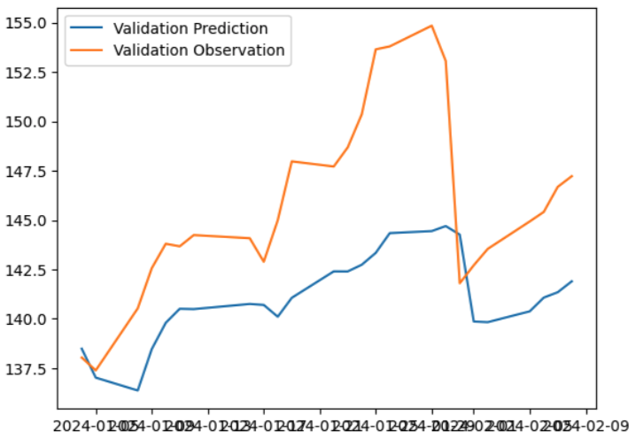
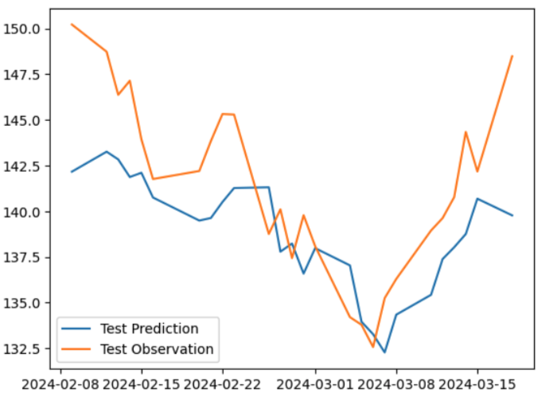

# Stock Price Prediction Using Long Short-Term Memory (LSTM)
## Description
 - This stock predictor utilized historical data and **Recurrant Neural Network** to forecast stock price
 - To be specific, **LSTM** was used in this project to provide time series forecasting (sequence prediction)
 - The time period of GOOG(Alphabet Inc.) stock price used in this model is from Mar-20-2023 to Mar-18-2024
 - The everyday closed price was chosen to train, validate, and test this model
   - First 80% partition of the data point was used to train the model
   - 80% to 90% partition of the data point was used to validate the model
   - Final 10% partition of the data point was used to test the model
     
     

## Results
- Actual Stock Price Chart (08/19/2004 - 03/19/2024)

  
  
-  Train Prediction Chart
  
   
  
-  Validation Prediction Chart

   
  
-  Test Prediction Chart

    
  
## Tools
  - Colab
  - pandas
  - numpy
  - matplotlib
  - Tensorflow
  - keras
## References
The code is based on and developed from
  - YouTube: [Stock Price Prediction and Forecasting with LSTM Neural Networks in Python](https://www.youtube.com/watch?v=CbTU92pbDKw)
  - Colab NoteBook: [Microsoft Stock Forecasting with LSTMs](https://colab.research.google.com/drive/1Bk4zPQwAfzoSHZokKUefKL1s6lqmam6S?usp=sharing)
Stock Dataset was downloaded from
  - [Yahoo Finance](https://finance.yahoo.com/)
